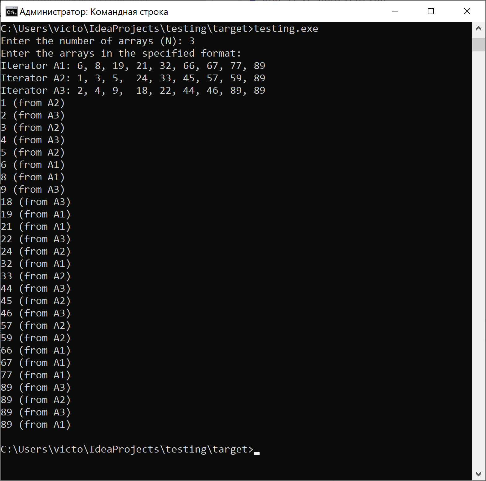

# Run test application
### Reference Documentation
* Go to bin folder and run testing.exe
* Input number of Iterators, example 3
* Next step you should input digits like 1, 2, 3, ...
* Then you will get sorted iterations
